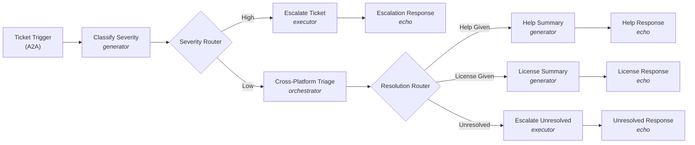

# Canonical Example: IT Help Investigation (GA)

The authoritative GA reference, sourced from `examples/agent-script/stgx-it-investigation-GA-ver` in `mulesoft-emu/agent-fabric-specification` (the working GA project). When in doubt about a field name, value, or indentation, mirror this example exactly.

GA adopts **A2A v1.0**. Agent Broker is backward-compatible with A2A v0.3 clients via the `a2a_v03` registry branch (shown below for `helpCenterAgent` and `licenseProcurementAgent`, which haven't migrated).

## What it does

Triages incoming IT support tickets and produces one of four outcomes:

| Outcome | When | What happens |
|---|---|---|
| Escalation | High-severity ticket | Ticket escalated to on-call team |
| Help Given | Low-severity, answer in knowledge base | Jira updated, user gets summary |
| License Provisioned | Low-severity, licensing issue resolved | License provisioned, Jira updated |
| Unresolved | Low-severity, no automated solution | Ticket escalated to a human agent |



LLM-powered nodes:
- `classifySeverity` — `generator` (pure classification, structured output, no actions/HITL).
- `crossPlatformTriage` — `orchestrator` (coordinates Help Center A2A, License Procurement A2A, Jira MCP toward compound triage goal).
- `helpSummary`, `licenseSummary` — `generator` (one-shot summary).

Deterministic nodes:
- `escalateTicket`, `escalateUnresolved` — `executor` (router-gated escalations).
- `severityRouter`, `resolutionRouter` — `router` (deterministic branching on enum outputs).

## Project structure

```
it-help-investigation/
  agent-network.yaml
  exchange.json
  brokers/
    it-help-investigation.agent
```

## `agent-network.yaml`

```yaml
agentNetwork: 2.0.0
info:
  label: "IT Help Investigation Agent Network"
  version: v1
registry:
  agents:
    helpCenterAgent:
      info:
        label: Help Center Agent
      metadata:
        platform: Other
        interfaces:
          a2a_v03:
            card:
              name: Help Center Agent
              description: Searches the IT knowledge base for answers to common issues. Returns relevant articles with step-by-step instructions.
              url: http://localhost:8080/helpCenterAgent
              protocolVersion: 0.3.0
              version: 1.0.0
              capabilities:
                pushNotifications: false
              defaultInputModes:
                - application/json
                - text/plain
              defaultOutputModes:
                - application/json
                - text/plain
              skills:
                - id: knowledge-search
                  name: Knowledge Base Search
                  description: Search for IT help articles and known solutions.
                  tags:
                    - knowledge-base
                    - it-support
                  examples:
                    - How do I reset my VPN password?
                    - My email is not syncing
                    - How do I set up two-factor authentication?
                  inputModes:
                    - application/json
                    - text/plain
                  outputModes:
                    - application/json
                    - text/plain
    licenseProcurementAgent:
      info:
        label: License Procurement Agent
      metadata:
        platform: Other
        interfaces:
          a2a_v03:
            card:
              name: License Procurement Agent
              description: Checks software license availability and provisions licenses for employees.
              url: http://localhost:8080/licenseProcurementAgent
              protocolVersion: 0.3.0
              version: 1.0.0
              capabilities:
                pushNotifications: false
              defaultInputModes:
                - application/json
                - text/plain
              defaultOutputModes:
                - application/json
                - text/plain
              skills:
                - id: license-check
                  name: License Check and Provision
                  description: Check license availability and provision for a user.
                  tags:
                    - licensing
                    - provisioning
                  inputModes:
                    - application/json
                    - text/plain
                  outputModes:
                    - application/json
                    - text/plain
  mcps:
    escalationMcp:
      info:
        label: Escalation MCP Server
      metadata:
        transport:
          kind: streamableHttp
          path: /mcp
    jiraMcp:
      info:
        label: Jira MCP Server
      metadata:
        transport:
          kind: streamableHttp
          path: /mcp
  llms:
    openAiMini:
      info:
        label: GPT-5 Mini
      metadata:
        platform: OpenAI
context:
  connections:
    helpCenterAgentConnection:
      kind: a2a
      ref:
        name: helpCenterAgent
      url: ${helpCenterAgent.url}
    licenseProcurementAgentConnection:
      kind: a2a
      ref:
        name: licenseProcurementAgent
      url: ${licenseProcurementAgent.url}
    escalationMcpConnection:
      kind: mcp
      ref:
        name: escalationMcp
      url: ${escalationMcp.url}
    jiraMcpConnection:
      kind: mcp
      ref:
        name: jiraMcp
      url: ${jiraMcp.url}
    openAiMiniConnection:
      kind: llm
      ref:
        name: openAiMini
      url: https://api.openai.com/v1
      authentication:
        kind: apiKey
        apiKey: ${openai.apiKey}
brokers:
  it-help-investigation:
    kind: AgentScript
    implementation: ./brokers/it-help-investigation.agent
    interfaces:
      a2a:
        card:
          name: IT Help Desk Broker
          description: Triages IT support tickets, escalates critical issues, and resolves common problems through cross-platform investigation.
          version: 1.0.0
          capabilities:
            streaming: false
            pushNotifications: true
          defaultInputModes:
            - text/plain
          defaultOutputModes:
            - text/plain
          skills:
            - id: ticket-triage
              name: IT Ticket Triage
              description: Classifies and resolves IT support tickets.
              tags:
                - it-support
                - help-desk
```

## `exchange.json`

```json
{
  "main": "agent-network.yaml",
  "name": "it-help-investigation",
  "classifier": "agentic-network",
  "organizationId": "${organizationId}",
  "descriptorVersion": "1.0.0",
  "tags": ["agentscript"],
  "metadata": {
    "variables": {
      "openai": {
        "apiKey": {
          "description": "OpenAI API key",
          "default": "",
          "secret": true
        }
      }
    }
  },
  "apiVersion": "v1.0",
  "dependencies": [],
  "groupId": "${organizationId}",
  "assetId": "it-help-investigation",
  "version": "1.0.0"
}
```

## `brokers/it-help-investigation.agent`

```text
# @dialect: AGENTFABRIC=0.1

system:
  instructions: "You are an IT Help Desk agent. You triage incoming support tickets, classify their severity, and either escalate, investigate, or request more information."

config:
  agent_name: "it-help-investigation"
  default_llm: @llm.openai_mini

llm:
  openai_mini:
    target: "llm://openAiMiniConnection"
    kind: "OpenAI"
    model: "gpt-5-mini"


# -- ACTION DEFINITIONS -------------------------------------------------------

actions:
  help_center_agent:
    target: "a2a://helpCenterAgentConnection"
    kind: "a2a:send_message"

  license_procurement_agent:
    target: "a2a://licenseProcurementAgentConnection"
    kind: "a2a:send_message"

  escalate:
    target: "mcp://escalationMcpConnection"
    kind: "mcp:tool"
    tool_name: "escalate"

  updateIssue:
    target: "mcp://jiraMcpConnection"
    kind: "mcp:tool"
    tool_name: "updateIssue"


# -- TRIGGER ------------------------------------------------------------------

trigger ticketTrigger:
  kind: "a2a"
  target: "brokers://it-help-investigation/a2a"
  on_message: ->
    transition to @generator.classifySeverity


# -- SEVERITY CLASSIFICATION --------------------------------------------------

generator classifySeverity:
  description: "Classifies the severity of the support ticket."
  label: "Classify Severity"
  llm: @llm.openai_mini
  system:
    instructions: |
      Classify the severity of the incoming IT support ticket and extract the Jira ticket ID.

      Classify as HIGH:
      - System outages affecting multiple users
      - Security incidents involving unauthorized access or suspicious activity
      - Any blocking issue impacting a team, building, or department

      Classify as LOW:
      - Password resets or connectivity help
      - Software license or access requests
      - Single-user issues with a clear description

      The ticket_id must always be a string value.
      If no Jira ticket ID is provided in the input, default ticket_id to "JIRA001".
  prompt: ->
    | {!@request.payload.message.parts[0].text}
  outputs:
    properties:
      ticket_id:
        type: "string"
        description: "The Jira ticket ID extracted from the input"
      severity:
        type: "string"
        description: "The severity level"
        enum:
          - "high"
          - "low"
      reason:
        type: "string"
        description: "Brief explanation of the classification"
  on_exit: ->
    transition to @router.severityRouter


# -- SEVERITY ROUTING ---------------------------------------------------------

router severityRouter:
  description: "Routes based on the classified severity."
  routes:
    - target: @executor.escalateTicket
      when: @generator.classifySeverity.output.severity == "high"
      label: "High"
  otherwise:
    target: @orchestrator.crossPlatformTriage


# -- HIGH: ESCALATION --------------------------------------------------------

executor escalateTicket:
  description: "Escalates the ticket using the Escalation MCP tool."
  do: ->
    run @actions.escalate
  on_exit: ->
    transition to @echo.escalationResponse

echo escalationResponse:
  kind: "a2a:status_update_event"
  state: "TASK_STATE_COMPLETED"
  message: a2a.message({messageId: uuid(), parts: [a2a.textPart("Ticket " + @generator.classifySeverity.output.ticket_id + " has been escalated to the on-call team due to high severity: " + @generator.classifySeverity.output.reason)]})


# -- LOW: CROSS-PLATFORM TRIAGE ----------------------------------------------

orchestrator crossPlatformTriage:
  description: "Investigates the ticket using Help Center and License Procurement agents."
  label: "Cross-Platform Triage"
  llm: @llm.openai_mini
  system:
    instructions: |
      Investigate this low-severity IT support ticket.
      Step 1: Search the Help Center agent for relevant articles or known solutions.
      Step 2: If the issue involves software licensing, check with the License Procurement agent.
      Step 3: Update the Jira ticket with your findings and resolution.
      If you found an answer from the Help Center, set resolution to "help_given".
      If you resolved a licensing issue, set resolution to "license_given".
      If you could not find a solution or the issue requires human intervention, set resolution to "unresolved".
      Always update the Jira ticket with resolution notes.
  reasoning:
    instructions: ->
      | {!@request.payload.message.parts[0].text}
    actions:
      search_help: @actions.help_center_agent
      check_license: @actions.license_procurement_agent
      update_ticket: @actions.updateIssue
    outputs:
      properties:
        resolution:
          type: "string"
          description: "The resolution type"
          enum:
            - "help_given"
            - "license_given"
            - "unresolved"
        summary:
          type: "string"
          description: "Summary of the resolution and actions taken"
  on_exit: ->
    transition to @router.resolutionRouter


# -- RESOLUTION ROUTING -------------------------------------------------------

router resolutionRouter:
  description: "Routes based on the resolution type from triage."
  routes:
    - target: @generator.licenseSummary
      when: @orchestrator.crossPlatformTriage.output.resolution == "license_given"
      label: "License Given"
    - target: @executor.escalateUnresolved
      when: @orchestrator.crossPlatformTriage.output.resolution == "unresolved"
      label: "Unresolved"
  otherwise:
    target: @generator.helpSummary


# -- HELP GIVEN PATH ----------------------------------------------------------

generator helpSummary:
  description: "Generates a summary of the help resolution."
  system:
    instructions: "You generate clear, friendly summaries of IT help desk resolutions."
  prompt: ->
    | Generate a resolution summary for the user. Original request: {!@request.payload.message.parts[0].text}. Resolution and actions taken: {!@orchestrator.crossPlatformTriage.output.summary}
  on_exit: ->
    transition to @echo.helpResponse

echo helpResponse:
  kind: "a2a:status_update_event"
  state: "TASK_STATE_COMPLETED"
  message: a2a.message({messageId: uuid(), parts: [a2a.textPart(@generator.helpSummary.output)]})


# -- LICENSE GIVEN PATH -------------------------------------------------------

generator licenseSummary:
  description: "Generates a summary of the license provisioning."
  system:
    instructions: "You generate clear, friendly summaries of license provisioning actions."
  prompt: ->
    | Generate a license provisioning summary for the user. Original request: {!@request.payload.message.parts[0].text}. Resolution and actions taken: {!@orchestrator.crossPlatformTriage.output.summary}
  on_exit: ->
    transition to @echo.licenseResponse

echo licenseResponse:
  kind: "a2a:status_update_event"
  state: "TASK_STATE_COMPLETED"
  message: a2a.message({messageId: uuid(), parts: [a2a.textPart(@generator.licenseSummary.output)]})


# -- UNRESOLVED PATH ----------------------------------------------------------

executor escalateUnresolved:
  description: "Escalates an unresolved low-severity ticket to a human agent."
  do: ->
    run @actions.escalate
  on_exit: ->
    transition to @echo.unresolvedResponse

echo unresolvedResponse:
  kind: "a2a:status_update_event"
  state: "TASK_STATE_COMPLETED"
  message: a2a.message({messageId: uuid(), parts: [a2a.textPart("Ticket " + @generator.classifySeverity.output.ticket_id + " could not be resolved automatically and has been escalated to a human agent. Summary: " + @orchestrator.crossPlatformTriage.output.summary)]})
```

## Non-obvious patterns this example confirms

These are the things the published docs don't make obvious — read the docs for everything else.

1. **`info.version: v1`** is valid — non-semver strings are accepted.
2. **`exchange.json` `"groupId": "${organizationId}"`** is the templated convention. `dependencies: []` is fine when all assets are inline.
3. **A2A v1.0 broker card** in this example omits `url` and `protocolVersion` — the broker IS the endpoint and serves itself. Per the spec these fields are required on a v1.0 card; broker cards are the practical exception. **Registry agent cards** (external agents) DO include `url`. For agents still on legacy A2A v0.3, place the card under `metadata.interfaces.a2a_v03.card` (kept for backward compatibility) — that branch keeps the old shape including `protocolVersion: 0.3.0` and `url`.
4. **Registry agents use `metadata.interfaces.<branch>.card`** with `branch` = `a2a` (current A2A v1.0), `a2a_v03` (legacy), or `other`. The Beta-era `metadata.protocol` + flat `metadata.card` shape no longer applies.
5. **Auth on connections** — `authentication` is REQUIRED for `kind: llm` connections. Optional for `a2a` and `mcp`. Auth kind `apiKey` (camelCase) is the canonical casing.
6. **MCP actions** in this example omit `inputs:` — the runtime auto-discovers tool arguments. Declare `inputs:` only when you need to use `with` clauses to fix or default values.
7. **A2A actions** in `reasoning.actions` are bare references — no `with message =`.
8. **`outputs:` placement** — generator at node top level (see `classifySeverity`), orchestrator/subagent nested inside `reasoning:` (see `crossPlatformTriage`).
9. **Echo node uses A2A v1.0 update events** — `kind: "a2a:status_update_event"` (state + message) or `kind: "a2a:artifact_update_event"` (artifact + append/lastChunk). The state value uses `TASK_STATE_*` constants (`TASK_STATE_COMPLETED`, `TASK_STATE_FAILED`, etc.).
10. **One echo per terminal path** — this example uses 4 separate echo nodes. Inside `a2a.message()` / `a2a.textPart()`, references are direct (`@generator.classifySeverity.output.ticket_id + " escalated"`). The `{!@...}` template form does NOT apply inside echo helpers.
11. **Dialect `# @dialect: AGENTFABRIC=0.1`** — pinned to GA dialect 0.1.
12. **`policies` shape (GA)** — when used, `policies` is an object with `inbound` and `outbound` arrays, not a flat list of policy ids.
