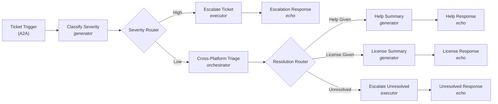

# Canonical Example: IT Help Investigation (GA)

The authoritative GA reference, sourced from the working GA example at `examples/agent-script/stgx-brokerV2-GA-it-investigation` in `mulesoft-emu/agent-fabric-specification`.

GA adopts the **A2A v1.0** standard. When in doubt about a field name, value, or indentation, mirror this example exactly.

## What it does

Triages incoming IT support tickets and produces one of four outcomes:

| Outcome | When | What happens |
|---|---|---|
| Escalation | High-severity ticket | Ticket escalated to on-call team |
| Help Given | Low-severity, answer in knowledge base | Jira updated, user gets summary |
| License Provisioned | Low-severity, licensing issue resolved | License provisioned, Jira updated |
| Unresolved | Low-severity, no automated solution | Ticket escalated to a human agent |



LLM-powered nodes:
- `classifySeverity` — `generator` (pure classification, structured output, no actions/HITL).
- `crossPlatformTriage` — `orchestrator` (coordinates Help Center A2A, License Procurement A2A, Jira MCP toward compound triage goal).
- `helpSummary`, `licenseSummary` — `generator` (one-shot summary).

Deterministic nodes:
- `escalateTicket`, `escalateUnresolved` — `executor` (router-gated escalations).
- `severityRouter`, `resolutionRouter` — `router` (deterministic branching on enum outputs).

## Project structure

```
it-help-investigation/
  agent-network.yaml
  exchange.json
  brokers/
    it-help-investigation.agent
```

## `agent-network.yaml`

```yaml
agentNetwork: 2.0.0
info:
  label: "IT Help Investigation Agent Network"
  version: v1
registry:
  agents:
    helpCenterAgent:
      info:
        label: Help Center Agent
      metadata:
        platform: Other
        interfaces:
          a2a:
            card:
              name: Help Center Agent
              description: Searches the IT knowledge base for answers to common issues. Returns relevant articles with step-by-step instructions.
              capabilities:
                pushNotifications: false
              version: 1.0.0
              defaultInputModes:
                - application/json
                - text/plain
              defaultOutputModes:
                - application/json
                - text/plain
              skills:
                - id: knowledge-search
                  name: Knowledge Base Search
                  description: Search for IT help articles and known solutions.
                  tags:
                    - knowledge-base
                    - it-support
                  examples:
                    - How do I reset my VPN password?
                    - My email is not syncing
                    - How do I set up two-factor authentication?
                  inputModes:
                    - application/json
                    - text/plain
                  outputModes:
                    - application/json
                    - text/plain
    licenseProcurementAgent:
      info:
        label: License Procurement Agent
      metadata:
        platform: Other
        interfaces:
          a2a:
            card:
              name: License Procurement Agent
              description: Checks software license availability and provisions licenses for employees.
              capabilities:
                pushNotifications: false
              version: 1.0.0
              defaultInputModes:
                - application/json
                - text/plain
              defaultOutputModes:
                - application/json
                - text/plain
              skills:
                - id: license-check
                  name: License Check and Provision
                  description: Check license availability and provision for a user.
                  tags:
                    - licensing
                    - provisioning
                  examples:
                    - Provision a Figma license for jane.doe@company.com
                    - Check if we have available GitHub Enterprise seats
                    - I need access to Jira
                  inputModes:
                    - application/json
                    - text/plain
                  outputModes:
                    - application/json
                    - text/plain
  mcps:
    escalationMcp:
      info:
        label: Escalation MCP Server
      metadata:
        transport:
          kind: streamableHttp
          path: /mcp
    jiraMcp:
      info:
        label: Jira MCP Server
      metadata:
        transport:
          kind: streamableHttp
          path: /mcp
  llms:
    gemini:
      info:
        label: Gemini
      metadata:
        platform: Gemini
context:
  connections:
    helpCenterAgentConnection:
      kind: a2a
      ref:
        name: helpCenterAgent
      url: ${helpCenterAgent.url}
    licenseProcurementAgentConnection:
      kind: a2a
      ref:
        name: licenseProcurementAgent
      url: ${licenseProcurementAgent.url}
    escalationMcpConnection:
      kind: mcp
      ref:
        name: escalationMcp
      url: ${escalationMcp.url}
    jiraMcpConnection:
      kind: mcp
      ref:
        name: jiraMcp
      url: ${jiraMcp.url}
    geminiConnection:
      kind: llm
      ref:
        name: gemini
      url: https://generativelanguage.googleapis.com
      authentication:
        kind: apiKey
        apiKey: ${gemini.apiKey}
brokers:
  it-help-investigation:
    kind: AgentScript
    implementation: ./brokers/it-help-investigation.agent
    interfaces:
      a2a:
        card:
          name: IT Help Desk Broker
          description: Triages IT support tickets, escalates critical issues, and resolves common problems through cross-platform investigation.
          version: 1.0.0
          capabilities:
            streaming: false
            pushNotifications: true
          defaultInputModes:
            - text/plain
          defaultOutputModes:
            - text/plain
          skills:
            - id: ticket-triage
              name: IT Ticket Triage
              description: Classifies and resolves IT support tickets.
              tags:
                - it-support
                - help-desk
```

## `exchange.json`

```json
{
  "main": "agent-network.yaml",
  "name": "IT Help Investigation Agent Network",
  "classifier": "agentic-network",
  "groupId": "${organizationId}",
  "assetId": "it-help-investigation-network",
  "version": "1.0.0",
  "description": "Triages IT support tickets, escalates critical issues, and resolves common problems through cross-platform investigation with Help Center and License Procurement agents.",
  "dependencies": [],
  "metadata": {
    "variables": {
      "helpCenterAgent": {
        "url": {
          "description": "Help Center Agent URL",
          "default": "",
          "secret": false
        }
      },
      "licenseProcurementAgent": {
        "url": {
          "description": "License Procurement Agent URL",
          "default": "",
          "secret": false
        }
      },
      "escalationMcp": {
        "url": {
          "description": "Escalation MCP Server URL",
          "default": "",
          "secret": false
        }
      },
      "jiraMcp": {
        "url": {
          "description": "Jira MCP Server URL",
          "default": "",
          "secret": false
        }
      },
      "gemini": {
        "apiKey": {
          "description": "Google Gemini API Key",
          "default": "",
          "secret": true
        }
      }
    }
  }
}
```

## `brokers/it-help-investigation.agent`

```text
# @dialect: AGENTFABRIC=0

system:
  instructions: "You are an IT Help Desk agent. You triage incoming support tickets, classify their severity, and either escalate, investigate, or request more information."

config:
  agent_name: "it-help-investigation"
  default_llm: @llm.gemini_flash


llm:
  gemini_pro:
    target: "llm://geminiConnection"
    kind: "Gemini"
    model: "gemini-2.5-pro"

  gemini_flash:
    target: "llm://geminiConnection"
    kind: "Gemini"
    model: "gemini-2.5-flash"


# -- ACTION DEFINITIONS -------------------------------------------------------

actions:
  help_center_agent:
    target: "a2a://helpCenterAgentConnection"
    kind: "a2a:send_message"

  license_procurement_agent:
    target: "a2a://licenseProcurementAgentConnection"
    kind: "a2a:send_message"

  escalate:
    target: "mcp://escalationMcpConnection"
    kind: "mcp:tool"
    tool_name: "escalate"
    inputs:
      ticket_id: string
      severity: string
      reason: string
      description: string

  updateIssue:
    target: "mcp://jiraMcpConnection"
    kind: "mcp:tool"
    tool_name: "updateIssue"
    inputs:
      ticket_id: string
      status: string
      comment: string


# -- TRIGGER -------------------------------------------------------------------

trigger ticketTrigger:
  kind: "a2a"
  target: "brokers://it-help-investigation/a2a"
  on_message: ->
    transition to @generator.classifySeverity


# -- SEVERITY CLASSIFICATION ---------------------------------------------------

generator classifySeverity:
  description: "Classifies the severity of the support ticket."
  label: "Classify Severity"
  llm: @llm.gemini_pro
  system:
    instructions: |
      Classify the severity of the incoming IT support ticket and extract the Jira ticket ID.

      Classify as HIGH:
      - System outages affecting multiple users (e.g. "VPN is down for the entire office", "Nobody in Building 3 can connect")
      - Security incidents involving unauthorized access or suspicious activity (e.g. "unauthorized login attempts from an IP in another country")
      - Any blocking issue impacting a team, building, or department

      Classify as LOW:
      - Password resets or connectivity help (e.g. "I forgot my VPN password")
      - Software license or access requests (e.g. "rate limited on my Figma MCP server", "I need access to Tableau")
      - Single-user issues with a clear description

      The ticket_id must always be a string value.
      If no Jira ticket ID is provided in the input, default ticket_id to "JIRA001".
  prompt: ->
    | {!@request.payload.message.parts[0].text}
  outputs:
    properties:
      ticket_id:
        type: "string"
        description: "The Jira ticket ID extracted from the input"
      severity:
        type: "string"
        description: "The severity level"
        enum:
          - "high"
          - "low"
      reason:
        type: "string"
        description: "Brief explanation of the classification"
  on_exit: ->
    transition to @router.severityRouter


# -- SEVERITY ROUTING ----------------------------------------------------------

router severityRouter:
  description: "Routes based on the classified severity."
  routes:
    - target: @executor.escalateTicket
      when: @generator.classifySeverity.output.severity == "high"
      label: "High"
  otherwise:
    target: @orchestrator.crossPlatformTriage


# -- HIGH: ESCALATION ---------------------------------------------------------

executor escalateTicket:
  description: "Escalates the ticket using the Escalation MCP tool."
  do: ->
    run @actions.escalate
      with ticket_id = @generator.classifySeverity.output.ticket_id
      with severity = "high"
      with reason = @generator.classifySeverity.output.reason
      with description = @request.payload.message.parts[0].text
  on_exit: ->
    transition to @echo.escalationResponse

echo escalationResponse:
  kind: "a2a:status_update_event"
  state: "TASK_STATE_COMPLETED"
  message: a2a.message({
    messageId: uuid(),
    parts: [
      a2a.textPart("Ticket " + @generator.classifySeverity.output.ticket_id + " has been escalated to the on-call team due to high severity: " + @generator.classifySeverity.output.reason)
    ]
  })


# -- LOW: CROSS-PLATFORM TRIAGE -----------------------------------------------

orchestrator crossPlatformTriage:
  description: "Investigates the ticket using Help Center and License Procurement agents."
  label: "Cross-Platform Triage"
  llm: @llm.gemini_pro
  system:
    instructions: |
      Investigate this low-severity IT support ticket.
      Step 1: Search the Help Center agent for relevant articles or known solutions.
      Step 2: If the issue involves software licensing, check with the License Procurement agent.
      Step 3: Update the Jira ticket with your findings and resolution.
      If you found an answer from the Help Center, set resolution to "help_given".
      If you resolved a licensing issue, set resolution to "license_given".
      If you could not find a solution or the issue requires human intervention, set resolution to "unresolved".
      Always update the Jira ticket with resolution notes.
  reasoning:
    instructions: ->
      | {!@request.payload.message.parts[0].text}
    actions:
      search_help: @actions.help_center_agent
      check_license: @actions.license_procurement_agent
      update_ticket: @actions.updateIssue
        with ticket_id = @generator.classifySeverity.output.ticket_id
    outputs:
      properties:
        resolution:
          type: "string"
          description: "The resolution type"
          enum:
            - "help_given"
            - "license_given"
            - "unresolved"
        summary:
          type: "string"
          description: "Summary of the resolution and actions taken"
  on_exit: ->
    transition to @router.resolutionRouter


# -- RESOLUTION ROUTING --------------------------------------------------------

router resolutionRouter:
  description: "Routes based on the resolution type from triage."
  routes:
    - target: @generator.licenseSummary
      when: @orchestrator.crossPlatformTriage.output.resolution == "license_given"
      label: "License Given"
    - target: @executor.escalateUnresolved
      when: @orchestrator.crossPlatformTriage.output.resolution == "unresolved"
      label: "Unresolved"
  otherwise:
    target: @generator.helpSummary


# -- HELP GIVEN PATH ----------------------------------------------------------

generator helpSummary:
  description: "Generates a summary of the help resolution."
  system:
    instructions: "You generate clear, friendly summaries of IT help desk resolutions."
  prompt: ->
    | Generate a resolution summary for the user. Original request: {!@request.payload.message.parts[0].text}. Resolution and actions taken: {!@orchestrator.crossPlatformTriage.output.summary}
  on_exit: ->
    transition to @echo.helpResponse

echo helpResponse:
  kind: "a2a:status_update_event"
  state: "TASK_STATE_COMPLETED"
  message: a2a.message({
    messageId: uuid(),
    parts: [
      a2a.textPart(@generator.helpSummary.output)
    ]
  })


# -- LICENSE GIVEN PATH --------------------------------------------------------

generator licenseSummary:
  description: "Generates a summary of the license provisioning."
  system:
    instructions: "You generate clear, friendly summaries of license provisioning actions."
  prompt: ->
    | Generate a license provisioning summary for the user. Original request: {!@request.payload.message.parts[0].text}. Resolution and actions taken: {!@orchestrator.crossPlatformTriage.output.summary}
  on_exit: ->
    transition to @echo.licenseResponse

echo licenseResponse:
  kind: "a2a:status_update_event"
  state: "TASK_STATE_COMPLETED"
  message: a2a.message({
    messageId: uuid(),
    parts: [
      a2a.textPart(@generator.licenseSummary.output)
    ]
  })


# -- UNRESOLVED PATH -----------------------------------------------------------

executor escalateUnresolved:
  description: "Escalates an unresolved low-severity ticket to a human agent."
  do: ->
    run @actions.escalate
      with ticket_id = @generator.classifySeverity.output.ticket_id
      with severity = "low"
      with reason = @orchestrator.crossPlatformTriage.output.summary
      with description = @request.payload.message.parts[0].text
  on_exit: ->
    transition to @echo.unresolvedResponse

echo unresolvedResponse:
  kind: "a2a:status_update_event"
  state: "TASK_STATE_COMPLETED"
  message: a2a.message({
    messageId: uuid(),
    parts: [
      a2a.textPart("Ticket " + @generator.classifySeverity.output.ticket_id + " could not be resolved automatically and has been escalated to a human agent. Summary: " + @orchestrator.crossPlatformTriage.output.summary)
    ]
  })
```

## Non-obvious patterns this example confirms

These are the things the published docs don't make obvious — read the docs for everything else.

1. **`info.version: v1`** is valid — non-semver strings are accepted.
2. **`exchange.json` `"groupId": "${organizationId}"`** is the templated convention. Don't replace with a literal UUID unless the user asks. `dependencies: []` is fine when all assets are inline.
3. **A2A v1.0 card** has NO `protocolVersion` field and NO `url` field. URLs live exclusively on `context.connections.<id>.url`. This is a key change from earlier specs.
4. **Registry agents use `metadata.interfaces.<branch>.card`** with `branch` = `a2a` (current A2A v1.0), `a2a_v03` (legacy A2A v0.3), or `other`. Most projects use `a2a:`. The old `metadata.protocol` + `metadata.card` shape no longer applies.
5. **Auth kind `apiKey` (camelCase)** is the canonical casing.
6. **Connection auth is required for LLMs** (`authentication` block). For A2A and MCP connections it's still optional.
7. **MCP actions DO declare `inputs:`** when the user knows the schema (see `escalate` and `updateIssue`). Declaring lets you use `with` clauses safely. When you don't know the schema, omit `inputs:` and the runtime auto-discovers.
8. **Inside `crossPlatformTriage` `reasoning.actions`:**
   - A2A actions (`search_help`, `check_license`) are **bare references** — no `with message =`.
   - MCP `update_ticket` has `with ticket_id = @generator.classifySeverity.output.ticket_id` (declared input).
9. **`outputs:` placement** — generator at node top level (see `classifySeverity`), orchestrator/subagent nested in `reasoning:` (see `crossPlatformTriage`).
10. **Echo node uses A2A v1.0 update events** — `kind: "a2a:status_update_event"` (state + message) or `kind: "a2a:artifact_update_event"` (artifact + append/lastChunk). The old `a2a:response` with nested `task: a2a.task({...})` is gone. The state value is in caps with the `TASK_STATE_*` prefix (`TASK_STATE_COMPLETED`, `TASK_STATE_FAILED`, etc.).
11. **One echo per terminal path** — this example uses 4 separate echo nodes. Inside `a2a.message()` / `a2a.textPart()`, references are direct (`@generator.classifySeverity.output.ticket_id + " escalated"`). The `{!@...}` template form does NOT apply inside echo helpers.
12. **Dialect `# @dialect: AGENTFABRIC=0`** — pinned to dialect major 0 for GA.
13. **No `policies` section** — V2 supports policies but the build flow doesn't surface them. Add via the edit workflow when needed. Note: GA `policies` is an object with `inbound` and `outbound` arrays, not a flat array.
